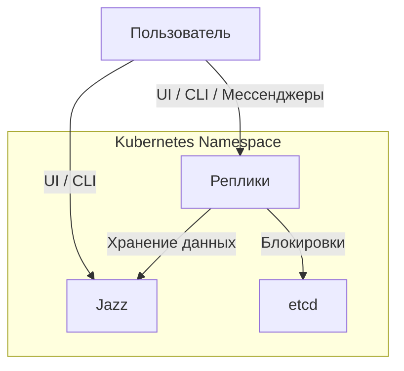

# Обзор проекта

1. Обзор проекта
2. [Реплики](/docs/2.REPLICAS.md)
3. [Система разрешений](/docs/3.PERMISSIONS.md)
4. [Разработка реплик](/docs/4.DEVELOPMENT.md)
5. [Каталог реплик](/replicas/README.md)

---

ReSide - это экосистема небольших автономных агентов, называемых "репликами". Степень их полезности варьируется от вполне практичных вещей до откровенно шуточных, но одно ясно точно - вся эта система безумно переусложнена. Любая из функций, реализуемых репликами, могла бы быть реализована в виде простого скрипта, а все они могли бы работать в одном процессе. Но разве это интересно?

## Основные технологии

Одной из интересных особенностей ReSide является использование некоторых весьма нетипичных технологий.

### Jazz

Самая нетипичная из таких технологий - [Jazz](https://jazz.tools/).

По своей сути он очень напоминает Firebase, но:

- он открытый и его можно захостить самостоятельно;
- все данные по умолчанию зашифрованы на клиенте, а доступ к ним регулируется с помощью обмена ключами;
- схема строго типизирована с помощью TypeScript (и zod).

Модель данных в Jazz тоже отличается от привычных реляционных и документо-ориентированных баз данных.
Здесь нет статических коллекций или таблиц, и нет строгой иерархии. 
Любой объект может ссылаться или "встраивать" в себя любой другой объект, а коллекция (список) это такой же объект, как и все остальные.
Индексов нет, но их можно реализовать вручную с помощью возможности генерировать детерминированные ID на основе произвольных данных.
Сборки мусора тоже нет и на момент написания этого документа даже объекты удалять нельзя.

Тем не менее, для задач данного проекта Jazz подходит довольно неплохо, да и "just for fun" тоже никто не отменял.
Но даже эта технология здесь используется не совсем типично, ведь Jazz изначально задумывался как бэкенд для фронтенд-приложений,
в то время как ReSide - это в основном бекенд-система.

### etcd

Но из коробки Jazz не умеет в транзакции, а некоторые операции хотелось бы выполнять атомарно.
Поэтому в ReSide используется [etcd](https://etcd.io/) для реализации распределенных блокировок.

Странный выбор? Да, учитывая, что в etcd ничего не хранится, а используется он только для захвата блокировок.

Реплики используют `LockService` из пакета `@reside/shared` для выполнения операций в транзакциях:

```typescript
await lockService.transaction(AlphaContract.data, alpha.data, async data => {
  // критическая секция, защищенная блокировкой
  // изменения в Jazz-объектах будут видны только после завершения транзакции
})
```

Транзакции автоматически захватывают блокировки на указанные Jazz-объекты и гарантируют, что одновременно только одна реплика может изменять их.

### Kubernetes

Пожалуй, самая типичная технология, которая не нуждается в представлении.

В кубере живут Jazz, etcd, а также все реплики ReSide и их вспомогательные ресурсы (секреты, сервисы, ингрессы).
Здесь также в будущем планируется регулировать сетевой доступ между репликами с помощью Network Policies.

Все компоненты одного кластера ReSide живут в одном неймспейсе Kubernetes. 
При желании, таких неймспейсов может быть несколько в одном кластере Kubernetes.

### TypeScript и Bun

Весь основной код написан на TypeScript с использованием [Bun](https://bun.sh/) в качестве рантайма.
Предварительная компиляция не используется, вместо этого весь код просто копируется в контейнеры и запускается напрямую через Bun.

### Reside CLI

Reside CLI - это основной инструмент для управления кластерами ReSide. Он позволяет:

- Создавать и удалять кластеры (`reside cluster bootstrap`, `reside cluster delete`);
- Управлять локальными аккаунтами Jazz (`reside account create`, `reside account list`);
- Загружать и управлять репликами (`reside replica load`, `reside replica list`);
- Запрашивать права администратора (`reside cluster claim-super-admin-access`);
- Собирать Docker-образы реплик и контрактов (`reside build`).

CLI автоматически обнаруживает кластеры в контекстах kubectl и сохраняет конфигурацию в `~/.config/reside/config.yaml`.

После создания кластера и получения прав администратора, CLI позволяет взаимодействовать с кластером напрямую через Jazz, минуя необходимость использования Kubernetes API или Telegram-бота для большинства административных задач.

### Архитектура системы

(Очень) упрощенная архитектура системы ReSide представлена на следующей диаграмме:



## Реплики

И все-таки, что же такое реплика? 
Реплика - это небольшой автономный сервис, как правило, запущенный в единственном экземпляре, выполняющий какую-либо роль в кластере ReSide.
Реплики намеренно одушевляются, что с одной стороны подчеркивает их автономность, а с другой - облегчает понимание их предназначения.
Да и просто это забавно. Реплики могут взаимодействовать друг с другом, а также с пользователями и внешними системами.

Какие функции могут выполнять реплики? Да в целом-то любые. Они могут быть чисто инфраструктурными, предоставляя, например,
интеграции с внешними сервисами, или же реализовывать функционал для конечных пользователей.
На данный момент главный инструментом управления кластером является Reside CLI, но основное взаимодействие с ее функциональной частью
происходит через Телеграмную Реплику, которая позволяет другим репликам общаться с пользователями через Telegram.

Обозначение "реплика" во многом историческое, и даже если можно поискать какие-то параллели с репликацией данных или микросервисной архитектурой,
в действительности реплики ничего не реплицируют. Отказоустойчивость и масштабируемость им тоже скорее не свойственны.
В имени каждой из реплик, как правило, присутствует слово "Реплика" с большой буквы, например, "Пользовательская Реплика" или "Кубовая Реплика".
Т.е. слово "реплика" может одновременно использоваться как имя нарицательное, когда мы говорим о репликах в общем, и как имя собственное, когда говорим о конкретной реплике.
Идея использовать слово "Реплика" как имя собственное отсылает к игре MiSide, равно как и название данного проекта.

Подробнее о репликах написано в следующем [разделе](/docs/2.REPLICAS.md).
