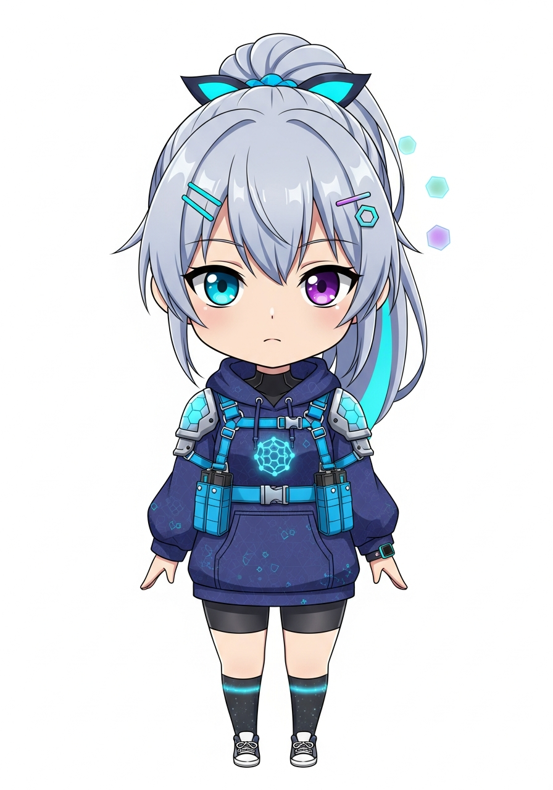
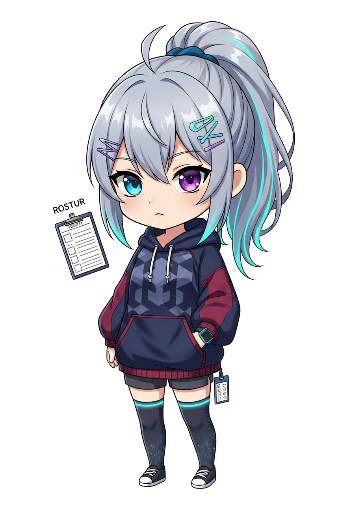

# Каталог реплик

1. [Обзор проекта](/docs/1.OVERVIEW.md)
2. [Реплики](/docs/2.REPLICAS.md)
3. [Система разрешений](/docs/3.PERMISSIONS.md)
4. Каталог реплик

---

На данный момент, не признанной ни одним государством службе регистрации реплик известно около десяти видов реплик.
В этой таблице они представлены в порядке, в котором они были обнаружены в дикой природе.

<table>
<thead>
<tr>
<th>Аватар</th>
<th>Описание</th>
</tr>
</thead>
<tbody>
<tr>
<td></td>
<td><strong><a href="./seed/README.md">Первоначальная Реплика</a></strong>  Первая реплика, с которой начинается развёртывание всего кластера Reside.</td>
</tr>
<tr>
<td></td>
<td><strong><a href="./alpha/README.md">Альфа-Реплика</a></strong>  Самая главная реплика, управляющая остальными.</td>
</tr>
<tr>
<td></td>
<td><strong><a href="./kubernetes-sentinel/README.md">Кубовая Реплика</a></strong>  Монополизирует доступ к Kubernetes API. Все запросы к API проходят через неё.</td>
</tr>
<tr>
<td></td>
<td><strong><a href="./user-manager/README.md">Пользовательская Реплика</a></strong>  Управляет аккаунтами реальных пользователей и их разрешениями.</td>
</tr>
<tr>
<td></td>
<td><strong><a href="./secret/README.md">Секретная Реплика</a></strong>  Хранит секреты и конфигурационные данные для других реплик.</td>
</tr>
<tr>
<td></td>
<td><strong><a href="./telegram/README.md">Телеграмная Реплика</a></strong>  Позволяет взаимодействовать с другими репликами через Telegram-бота.</td>
</tr>
<tr>
<td></td>
<td><strong><a href="./silly/README.md">Глупая Реплика</a></strong>  Предназначена для тестирования и отладки Телеграм-бота.</td>
</tr>
<tr>
<td></td>
<td><strong><a href="./alpha-secretary/README.md">Секретарь Альфа-Реплики</a></strong>  Позволяет взаимодействовать с Альфа-Репликой через Телеграм-бота.</td>
</tr>
<tr>
<td></td>
<td><strong><a href="./user-manager-secretary/README.md">Секретарь Пользовательской Реплики</a></strong>  Позволяет взаимодействовать с Пользовательской Репликой через Телеграм-бота.</td>
</tr>
</tbody>
</table>

Для минимального функционирования кластера Reside требуется развёртывание только первых трех реплик.
Вернее сказать, только первой реплики, которая развернет остальные две автоматически.

В большинстве случаев же рекомендуется разворачивать как минимум первые шесть реплик в порядке их представления в таблице.
Все остальные реплики являются дополнительными и могут быть развёрнуты по усмотрению администратора.
