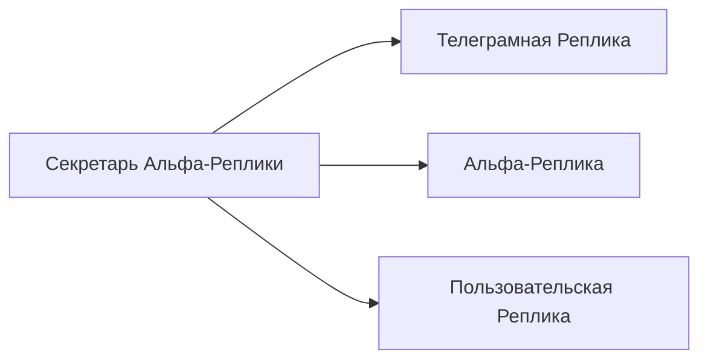

# Секретарь Альфа-Реплики

[Назад к списку реплик](/replicas/README.md)

<table>
<tr>
<td valign="top">

Эта реплика позволяет взаимодействовать с [Альфа-Репликой](/replicas/alpha/README.md) через Телеграм-бота.

</td>
<td>

</td>
</tr>
</table>

## Зависимости

## Команды

Секретарь Альфа-Реплики поддерживает следующие команды:

| Команда        | Описание                                                                                                                                  |
| -------------- | ----------------------------------------------------------------------------------------------------------------------------------------- |
| `/replicas`    | Выводит интерактивный список всех реплик в кластере, в котором можно выбрать интересующую реплику и получить по ней подробную информацию. |
| `/contracts`   | Выводит интерактивный список всех контрактов, реализуемых в кластере, с возможностью получить по ним подробную информацию.                |
| `/permissions` | Выводит список всех разрешений, поддерживаемых в кластере.                                                                                |
