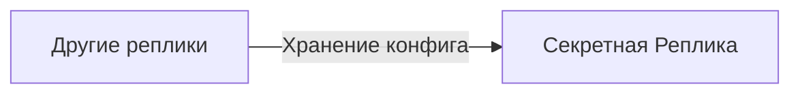

# Секретная Реплика

[Назад к списку реплик](/replicas/README.md)

<table>
<tr>
<td valign="top">

Эта реплика предназначена для структурированного хранения секретов, а также любой другой конфигурации, необязательно секретной.

</td>
<td>


</td>
</tr>
</table>

## Принцип работы

Секретная Реплика предоставляет централизованное хранилище для конфигурационных данных, которые могут потребоваться другим репликам. В отличие от Kubernetes Secrets, данные в Секретной Реплике хранятся в Jazz и доступны через единый интерфейс.

Данные организованы в виде пар ключ-значение, где значение может быть как простой строкой, так и сложным JSON-объектом. Каждый секрет имеет свой набор разрешений, позволяющий гранулярно управлять доступом.

## API

Для взаимодействия с Секретной Репликой предусмотрен хелпер `defineSecret`, который можно импортировать из пакета `@contracts/secret.v1`. [Пример использования](/replicas/telegram/src/config.ts) можно посмотреть в [Телеграмной Реплике](/replicas/telegram/README.md).

Пример определения секрета:

```typescript
import { defineSecret } from "@contracts/secret.v1"

const botToken = defineSecret({
  name: "telegram-bot-token",
  description: "Токен Telegram-бота",
  schema: z.string(),
})
```

Для чтения секрета используйте метод `get`:

```typescript
const token = await botToken.get(secretContract)
```

Для записи секрета требуется разрешение `secret:write:{name}`, которое должно быть явно запрошено в манифесте реплики.

## Зависимости



## Разрешения

Секретная Реплика предоставляет следующие разрешения:

- `secret:read:{name}` - чтение конкретного секрета по имени;
- `secret:write:{name}` - запись конкретного секрета по имени;
- `secret:read:all` - чтение всех секретов;
- `secret:write:all` - запись всех секретов.

Параметризованные разрешения позволяют выдавать доступ только к необходимым секретам, следуя принципу наименьших привилегий.
