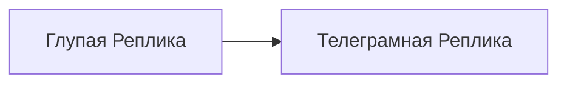

# Глупая Реплика

[Назад к списку реплик](/replicas/README.md)

<table>
<tr>
<td valign="top">

Она правда глупая.

</td>
<td>

</td>
</tr>
</table>

## Назначение

Глупая Реплика - это демонстрационная и тестовая реплика, которая служит простым примером интеграции с [Телеграмной Репликой](/replicas/telegram/README.md). Она реализует базовый набор команд и показывает, как реплики могут обрабатывать сообщения из Telegram.

## Зависимости

## Команды

Глупая Реплика поддерживает следующие команды:

| Команда | Описание |
| ------- | -------- |
| `/silly` | Выводит глупое приветственное сообщение |
| `/echo <текст>` | Повторяет введенный текст обратно пользователю |

## Использование как примера

Код Глупой Реплики можно использовать как шаблон для создания новых реплик с Telegram-интерфейсом:

1. [Определение обработчика](/replicas/silly/src/handler.ts) показывает, как регистрировать обработчик в Телеграмной Реплике;
2. [Composer](/replicas/silly/src/composer.ts) демонстрирует, как обрабатывать команды с помощью grammy;
3. [Главный файл](/replicas/silly/src/main.ts) показывает минимальную структуру точки входа реплики.

Для создания новой реплики с Telegram-интерфейсом можно скопировать структуру Глупой Реплики и адаптировать ее под свои нужды.
