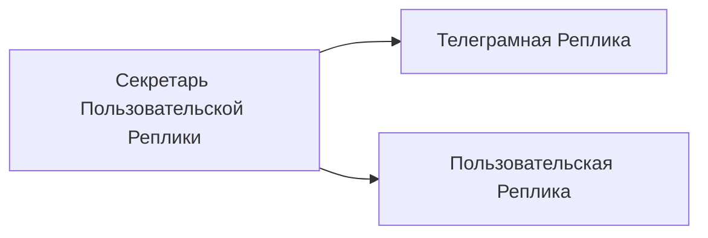

# Секретарь Пользовательской Реплики

[Назад к списку реплик](/replicas/README.md)

<table>
<tr>
<td valign="top">

Эта реплика позволяет взаимодействовать с [Пользовательской Репликой](/replicas/user-manager/README.md) через Телеграм-бота.

</td>
<td>

</td>
</tr>
</table>

## Зависимости

## Команды

Секретарь Пользовательской Реплики поддерживает следующие команды:

| Команда    | Описание                                                                                              |
| ---------- | ----------------------------------------------------------------------------------------------------- |
| `/profile` | Выводит информацию о профиле пользователя, включая его ID в системе и список выданных ему разрешений. |
